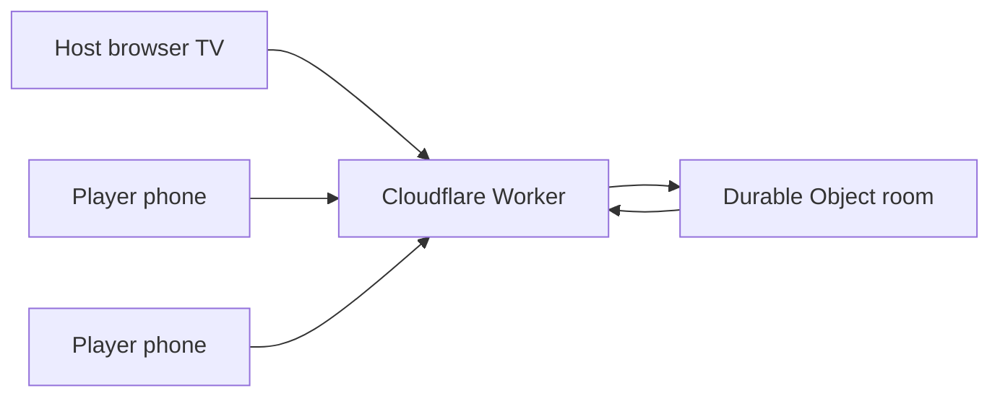

# Party Games

Couch party games: one TV or laptop as the **host display**, phones as **private controllers**—built for living-room play, not solo screen time.

**Status:** Deployed and actively maintained. **Live app:** https://party-games.jimb99.workers.dev/

Family-friendly and mature content pools are **separate**; hosts choose mature content per session in the lobby.

---

## Why

PartyGames explores real-time multiplayer UX: each player sees secret prompts and inputs on their phone while the TV shows shared phases, scores, and reveals. The hard parts are session sync, anti-leak host views, and testing 21 game engines under min/max player counts.

---

## Architecture



- **Worker + Durable Object** (`partyserver`, `wrangler`): one room object owns authoritative game state and WebSocket fan-out.
- **Monorepo:** `shared` (protocol + engines), `server` (room lifecycle), `client` (React host/player UI).
- **Content:** JSON pools per game; validation in CI (`content-validation.test.ts`, strict pool thresholds).

Project conventions for agents and contributors: `.cursor/rules/partygames-testing.mdc`.

---

## Engineering highlights

| Area | What |
|------|------|
| Contract tests | Every registered game simulated at min/max players (`pnpm test:contract`) |
| Content QA | Pool size gates, duplicate-truth heuristics, family/mature separation (`pnpm test:content`) |
| Dead exports | `pnpm audit:dead-exports` in verify pipeline |
| Viewports | Playwright matrix for host/player layouts (`pnpm test:e2e:viewport`) |
| Game audit | Interaction coverage audit (`pnpm test:games:audit`) |

Internal QA write-ups: [docs/audit-2026-09.md](docs/audit-2026-09.md), [docs/qa-findings.md](docs/qa-findings.md), [docs/content-inventory.md](docs/content-inventory.md).

---

## Stack

- **Cloudflare Workers + Durable Objects** (via `partyserver` + `wrangler`)
- **React + Vite + Tailwind** (client, served from the same Worker)
- **TypeScript monorepo** (`shared`, `server`, `client`)

---

## Games (21)

Display names match lobby copy. Protocol IDs are kebab-case. Several games support **mode settings** in the lobby (e.g. Bluff: fill-in-blank vs reverse-question).

| ID | Display name |
|----|----------------|
| bluff | Bluff |
| prompt-vote | Write & Vote |
| opinions | Opinions |
| spectrum | Spectrum |
| impostor | Impostor |
| agent-grid | Agent Grid |
| bracket-battle | Bracket Battle |
| forbidden-clue | Forbidden Clue |
| team-charades | Team Charades |
| last-on-the-dike | Last on the Dike |
| trivia | Trivia |
| drawing | Drawing |
| trail-dash | Trail Dash |
| word-rush | Word Rush |
| block-stack | Block Stack |
| grid-blast | Grid Blast |
| paddle-clash | Paddle Clash |
| hangman-race | Hangman Race |
| fleet-duel | Fleet Duel |
| four-in-a-row | Four in a Row |
| tic-tac-toe | Tic-Tac-Toe |

---

## Getting started

```bash
pnpm install
pnpm verify
pnpm dev   # see package scripts for local Worker + client
```

---

## Testing

```bash
pnpm verify          # typecheck + unit + contract + content + dead-export scan
pnpm test:games      # game engine smoke + scoring
pnpm test:games:audit # E2E interaction coverage audit
pnpm test:contract   # shared protocol tests
```

---

## License

MIT — see [LICENSE](LICENSE).
